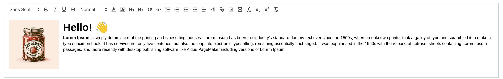

# Spillgebees.Blazor.RichTextEditor

    
    

`Spillgebees.Blazor.RichTextEditor` is a [WYSIWYG](https://en.wikipedia.org/wiki/WYSIWYG) Blazor component enabling rich text content editing. It is powered by [Quill](https://github.com/quilljs/quill).

This component is based on a mix of the following repos:

- [chrissainty's `Blazored.TextEditor`](https://github.com/Blazored/TextEditor), the original implementation.
- [vixys' fork of `Blazored.TextEditor`](https://github.com/Vixys/TextEditor), mainly the `OnTextChanged` implementation logic.
- [somegenericdev's `WYSIWYGTextEditor`](https://github.com/somegenericdev/WYSIWYGTextEditor), mainly the more convenient usage/component structure.

More details in the [documentation](./src/Spillgebees.Blazor.RichTextEditor/README.md).

Live demo: [net7.0](https://spillgebees.github.io/Blazor.RichTextEditor/main/net7.0/), [net8.0](https://spillgebees.github.io/Blazor.RichTextEditor/main/net8.0/)
