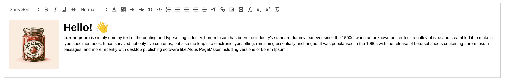

<div align="center">
    
    <p><em>Rich text editing for Blazor, powered by Quill.</em></p>
</div>

[](https://github.com/Spillgebees/Blazor.RichTextEditor/actions/workflows/build-and-test.yml)
[](https://www.nuget.org/packages/Spillgebees.Blazor.RichTextEditor)
[](https://www.nuget.org/packages/Spillgebees.Blazor.RichTextEditor)
[](https://spillgebees.github.io/Blazor.RichTextEditor)
[](LICENSE)

`Spillgebees.Blazor.RichTextEditor` is a WYSIWYG Blazor component powered by [Quill](https://quilljs.com/).

See the [documentation and demos](https://spillgebees.github.io/Blazor.RichTextEditor) for installation guides, examples, and live components.

## Features

- Two-way binding for HTML content, plain text, selection, enabled state, and touched state
- Basic, full, hidden, repositioned, or completely custom toolbars
- Snow and Bubble themes, custom fonts, accessible keybindings, and configurable event debouncing
- A passive editor for large documents and embedded content where on-demand synchronization is preferable

## Quick example

```razor
@using Spillgebees.Blazor.RichTextEditor.Components
@using Spillgebees.Blazor.RichTextEditor.Components.Toolbar

<RichTextEditor @bind-Content="_content"
                ToolbarOptions="ToolbarOptions.FullToolbarOptions"
                UseAccessibleKeybindings="@true" />

@code {
    private string _content = "<p><strong>Hello from Blazor!</strong> 👋</p>";
}
```

## Acknowledgements

The component builds on ideas from [Blazored.TextEditor](https://github.com/Blazored/TextEditor),
[Vixys/TextEditor](https://github.com/Vixys/TextEditor), and
[WYSIWYGTextEditor](https://github.com/somegenericdev/WYSIWYGTextEditor).
